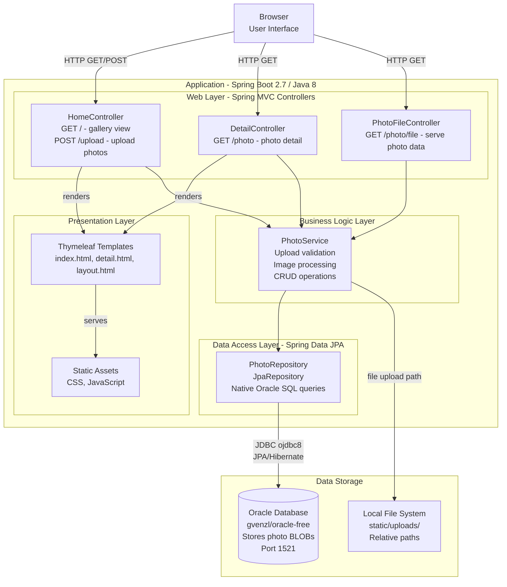
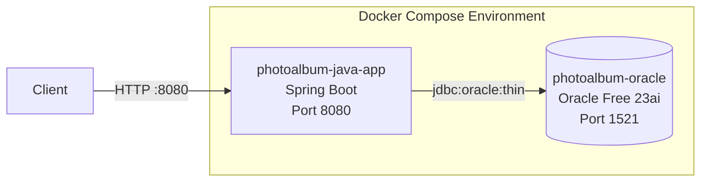

# Photo Album Application - Architecture Diagram

## Application Architecture

## Technology Stack

| Layer | Technology |
|-------|-----------|
| Language | Java 8 |
| Framework | Spring Boot 2.7.18 |
| Web | Spring MVC |
| Templating | Thymeleaf |
| ORM | Spring Data JPA / Hibernate |
| Database | Oracle Database (ojdbc8) |
| File I/O | Apache Commons IO |
| Build | Maven |
| Container | Docker / Docker Compose |

## Assessment Findings Summary

The AppCAT assessment identified the following areas for cloud migration consideration:

| Finding | Rule | Description |
|---------|------|-------------|
| Relative file path | azure-file-system-02000 | Application uses relative paths for file storage which is not suitable for cloud deployments |
| Hardcoded password | azure-password-01000 | Passwords found in configuration files should be stored in a secrets manager |
| Static content | spring-boot-to-azure-static-content-01000 | Static content should be served from a CDN or blob storage in cloud deployments |

## Deployment Architecture

